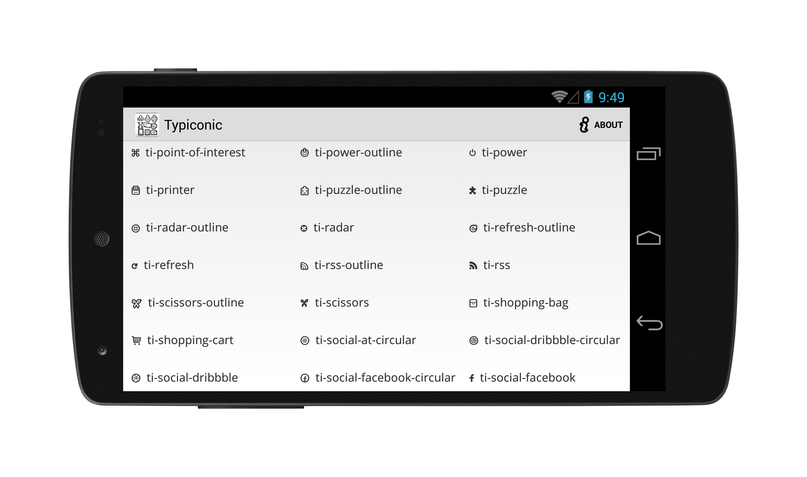

Typiconic
=========



Based on Iconic from **[JoanZapata's android-iconify](https://www.github.com/JoanZapata/android-iconify)** library, allowing to use all advantages of 308 icon font named **[Typicons](http://typicons.com/)**.


This library adds 2 new widgets to Android, that is ```TypiconTextView``` and ```TypiconButton```. These two widget allows anybody to put icon before text or just icon in text widget.

One can also use ```TypiconicDrawable``` to generate Drawable based on any glyph from font.

Get it
------
Grab the [JAR][1] or add a dependency from Maven central:

```groovy
dependencies {
  debugCompile 'mobi.cwiklinski:typiconic:1.0.0'
}
```
License
--------

    Copyright 2013 Michał Ćwikliński

    Licensed under the Apache License, Version 2.0 (the "License");
    you may not use this file except in compliance with the License.
    You may obtain a copy of the License at

       http://www.apache.org/licenses/LICENSE-2.0

    Unless required by applicable law or agreed to in writing, software
    distributed under the License is distributed on an "AS IS" BASIS,
    WITHOUT WARRANTIES OR CONDITIONS OF ANY KIND, either express or implied.
    See the License for the specific language governing permissions and
    limitations under the License.


 [1]: http://repository.sonatype.org/service/local/artifact/maven/redirect?r=central-proxy&g=mobi.cwiklinski&a=typiconic&v=LATEST&c=jar